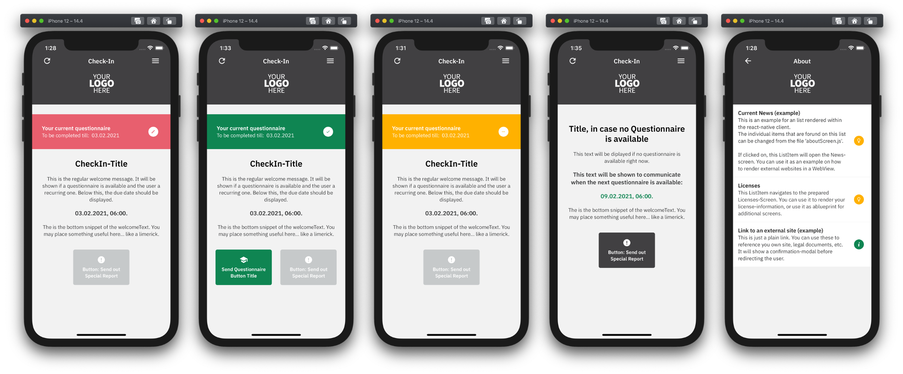
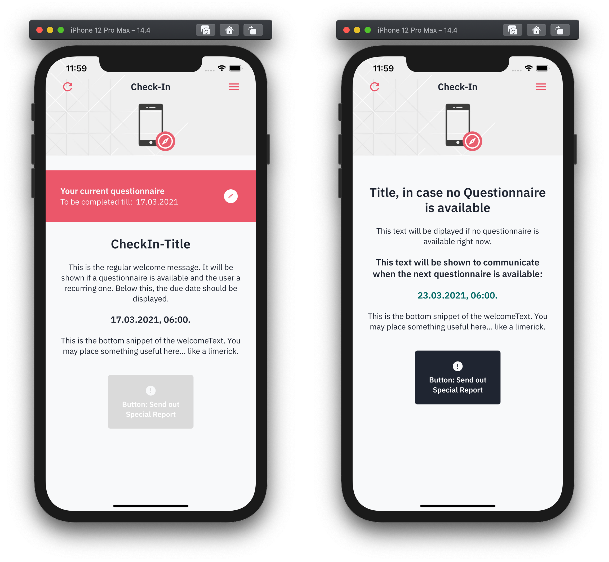
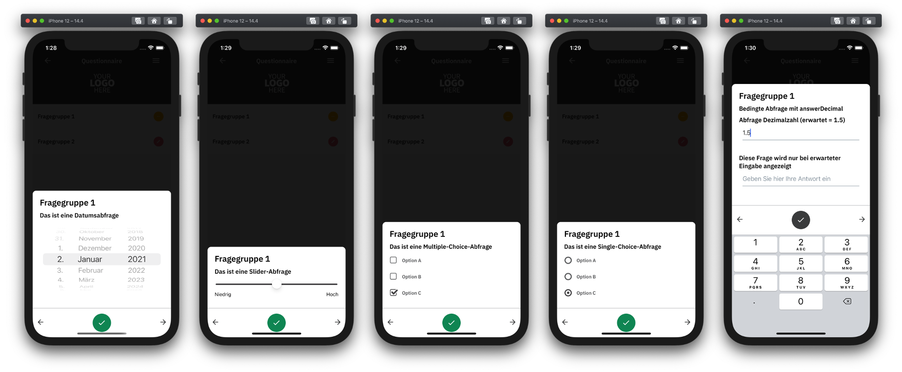
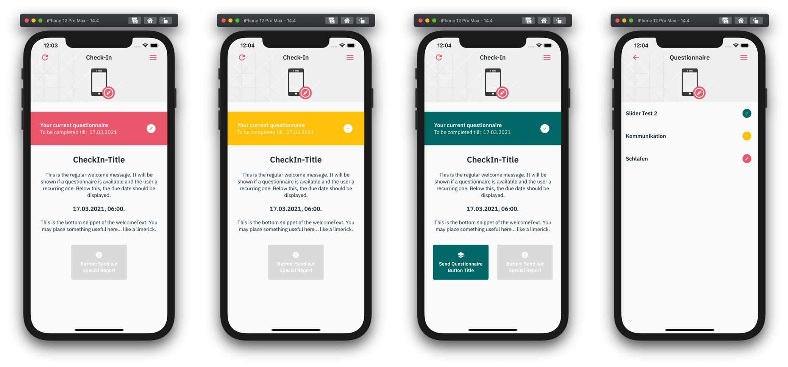

:tip-caption: :bulb:
:note-caption: :information_source:
:important-caption: :heavy_exclamation_mark:
:caution-caption: :fire:
:warning-caption: :warning:

= NUM-App (React Native Client - iOS & Android)

https://github.com/NUMde/compass-numapp[Main Repository] | link:./docs[Frontend Documentation]

== Welcome
This repository provides the source code for the React Native client of the link:https://github.com/NUMde/compass-numapp[Compass NUM-App Project]. This project provides a set of open source components meant for the digital conduct of questionnaire based studies. NUM-App itself is a  part of link:https://num-compass.science/[COMPASS] (**C**oordination **O**n **M**obile **P**andemic **A**pps best practice and **S**olution **S**haring).

The NUM-App enables the display of link:https://www.hl7.org/fhir/questionnaire.html[FHIR Questionnaires] as well as the encrypted transmission and storage of corresponding link:https://www.hl7.org/fhir/questionnaireresponse.html[FHIR Questionnaire Responses].

== Features

The client provides these main functionalities:

. *Login & User Management*
+ 
--
Users can authenticate using a QR-Code, which contains the ID for his/her participation. This ID will be persisted on the device to automatically log the user in the next time the app is opened. +
Every time the user triggers an action that enables a connection to the link:https://github.com/NUMde/compass-numapp-backend[backend], the user will be updated and the frontend refreshed (with the data of the now updated user).

IMPORTANT: The user has no option to logout - as soon as he/she is logged in it stays that way. But while in development mode a logout button is available from the burger menu.
--

. *FHIR Questionnaire Retrieval*
+ 
--
The application will download a questionnaire as soon as an updated user suggests that a new one is available. When restarting the app the questionnaire (and the given answers) of the last active user will be loaded from the local storage. Should the ID of that questionnaire not match the one transmitted with the user object, the local one will be deleted and a new one from the link:https://github.com/NUMde/compass-numapp-backend[backend] procured. 

IMPORTANT: The decision which questionnaire the user will get is made in the link:https://github.com/NUMde/compass-numapp-backend[backend].

The user will always be informed when a given questionnaire is due as well when the next one is available as this information is displayed on the *CheckIn-Screen*:

--

. *FHIR Questionnaire Rendering & Interaction*
+ 
--
The application can render a version of the FHIR Questionnaire standard that obliged with a certain ruleset for numbering items and a few other contextual additions. The rendering is done in a modal that separates topics by id and that way provides the questions on several pages - for the convenience of the user:

The questionnaire as a whole as well as single categories and single questions are constantly checked for their completion state. This is visible due to several colors used in the application.

The used colors can of course be customized.
--

. *FHIR Questionnaire Response Encryption & Transmission*
+ 
--
As soon as a questionnaire is completed it can be sent to the link:https://github.com/NUMde/compass-numapp-backend[backend]. Based on a predefined ruleset (provided by the link:https://github.com/NUMde/compass-numapp-backend[backend] or through a local definition) a few parameters are determined and after that the Questionnaire Response is created and encrypted. This encrypted response plus the ascertained parameters are then send to the link:https://github.com/NUMde/compass-numapp-backend[backend]. + 

The parameters are then used to determine the update values for the user (as the response is now encrypted and not accessible for the link:https://github.com/NUMde/compass-numapp-backend[backend]). Meaning when the next questionnaire will be available, what ID that questionnaire will have, etc.
--

. *Transmitting a Report (if no questionnaire is available)*
+ 
--
If no questionnaire is available the user has the option to transmit a report. This report is nothing more than REST-call to the link:https://github.com/NUMde/compass-numapp-backend[backend] that can only be send out when no questionnaire is available. There is no actual data transmission aside from the fact that the call was send out. This is meant for situations that need reporting while no questionnaire (through which the user would normally report such an event) is available. 

The incoming report will trigger a user update within the link:https://github.com/NUMde/compass-numapp-backend[backend]. This might then lead to another questionnaire.
--

== Basic App Flow

Aside from opening menus and links, the app does basically just four things:

. *User Update* 
+ 
--
The app will query the user. This happens almost every time a connection to the link:https://github.com/NUMde/compass-numapp-backend[backend] is established:

** login -> user update
** manual refresh -> user update
** sending out a questionnaire -> user update
** sending out a report -> user update

--

. *The app will update its own state based on the data from the user update*
+ 
--
The user update provides information that influences what the app will allow the user to do as well what is displayed. If a new questionnaire is available it will be downloaded and the due date will be displayed. Is there no questionnaire available the the starting date of the next interval will bis presented. 
Should the due date be exceeded then the local questionnaire will be deleted.
--

. *The app renders a received questionnaire and allows the user to interact with it*
+
--
The user answers the questionnaire. The app checks if the questionnaire was answered completely (as only then it can be send to the link:https://github.com/NUMde/compass-numapp-backend[backend]).
--

. *The user sends out a completed questionnaire (or a report)*
+
--
The user can send out a fully completed questionnaire (as long as its due date is not reached) in form of a questionnaire response. The app will encrypt the response and, after sending it out, request a *user update*. Sending put a report is basically the same thing, just without a encrypted questionnaire response.
--

== Why React Native?

=== Cross-Platform Development
The Num-App is supposed to be available on Android and iOS. React Native saves time by using a single code base to deploy to multiple mobile operating systems. Components are reused anytime at any level into existing code without you rewriting it and recompiling the app.The framework is open-source and therefore available to a whole community of developers. It allows writing native module in a comparable language and linking it to React Native codebase in a simple way. It’s needed in case you develop some features which aren’t supported for now by React Native libraries.

Moreover, React Native has the *live reload* feature, which isn’t available for other native frameworks. It allows viewing the latest code changes in real time. If two screens are opened, the first one shows the code, while the second one contains a mobile screen as a result of the code. + 

You can even run development builds on both systems in parallel:
image:./docs/images/parallel.png[auto, auto]

=== Use of existing Knowledge
React Native does not need any special technical know-how. A basic knowledge of JavaScript is needed, but that's basically it. JavaScript developers with little self-education can use React Native to jump right into the development of the mobile app - for iOS and Android.

== Where to Start?
Even though a basic knowledge of JavaScript is enough for the setup und build of the application, an understanding of the following topics can be helpful for the further development of the project:

* *JavaScript*
* *Node.js*
* *React.js*
* *Redux*
* *RESTful Services*

Aside from that, the *`link:./docs[frontend documentation]`* gives you a good starting point. It covers the the setup process, the app configuration as well as all customization steps and tips for build and deployment.
