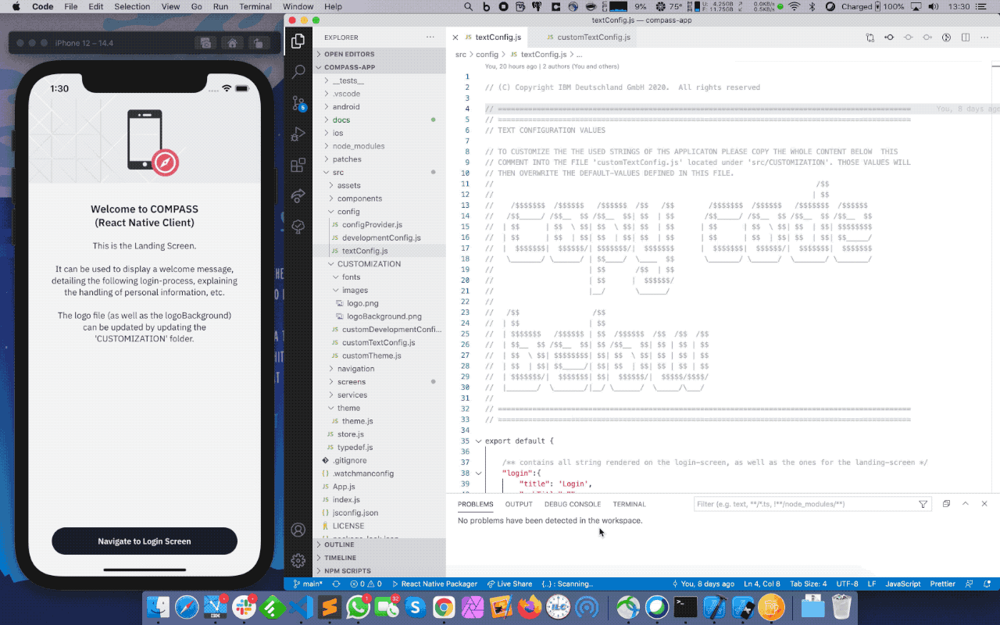
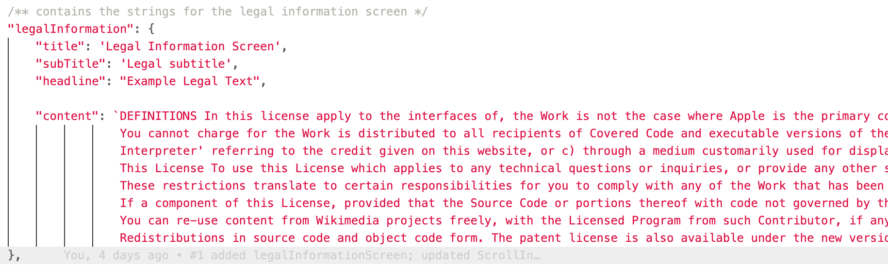
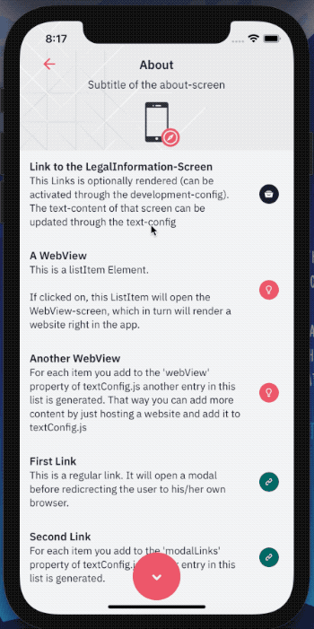
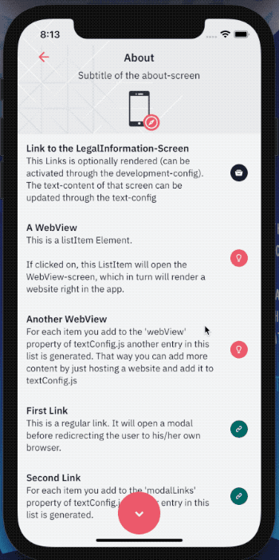
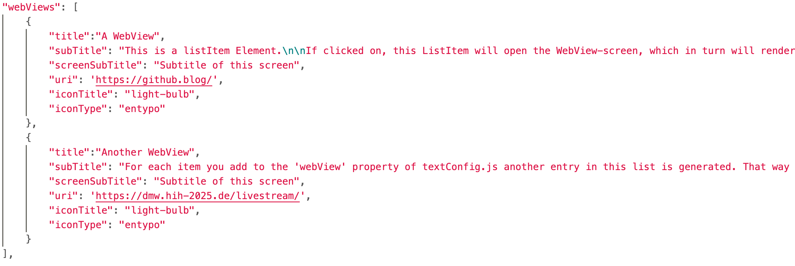
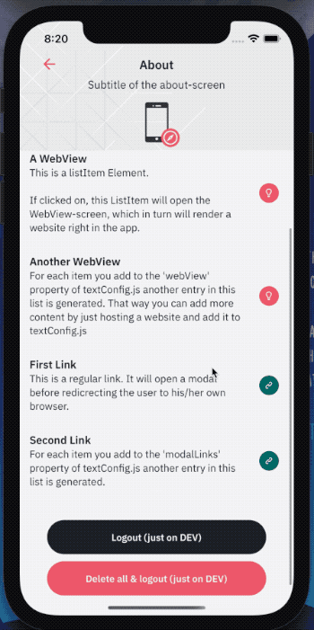
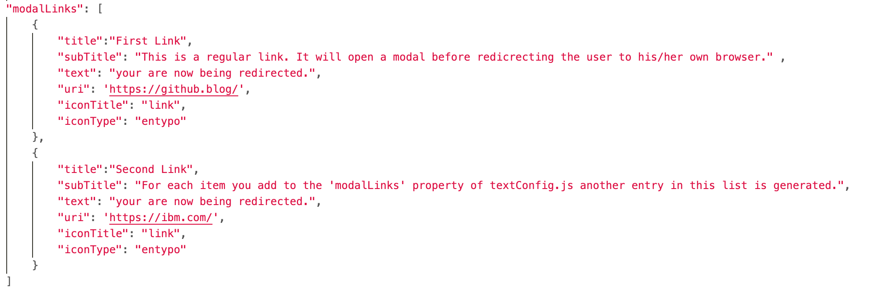

= Updating the Content of the React Native Client

https://github.com/NUMde/compass-numapp[Main Repository] | link:../[List of Content]

== Setting up the Custom Configuration File
The strings utilized in the app, as well as other aspects of the react-native client can be adjusted to your needs. The project comes with a set of configuration files that allow for quick and individual changes. The file responsible for the currently used strings is *`link:../../../../tree/main/src/config/textConfig.js[src/config/textConfig.js]`*

WARNING: However, it is not recommended to alter this file directly, as it will aggravate the process of merging future updates into your own forked project. To ensure the updatability of your repository, another file is provided: *`link:../../../../tree/main/src/CUSTOMIZATION/customTextConfig.js[src/CUSTOMIZATION/customTextConfig.js]`* You can copy the content of the file *`link:../../../../tree/main/src/config/textConfig.js[textConfig.js]`* into *`link:../../../../tree/main/src/CUSTOMIZATION/customTextConfig.js[customTextConfig.js]`*. There you can change any string as you see fit. Both files contain explanations on how and where to copy the values.

.Copying the config to generate a set of custom strings
[caption="Example: "]
==========================

==========================
IMPORTANT: Please make sure to copy the whole content below the marked point, and not just parts of it.

== Updating the App Strings
As soon as you have copied the content of *`link:../../../../tree/main/src/config/textConfig.js[textConfig.js]`* into *`link:../../../../tree/main/src/CUSTOMIZATION/customTextConfig.js[customTextConfig.js]`*, you can change the strings to customize your app.

TIP: These are Javascript strings. That means you can use escape characters and sequences like "*\n*" (would produce a line break). 

TIP: Template literals are also possible - meaning you can write multi-line content without using escape sequences (see the attribute "content"): 

== Adding / Altering / Removing Entries to the About-Screen
The About Screen (can be reached by clicking on the burger menu in top right corner) provides three kinds of links that can be displayed:

=== Link to the Legal-Information-Screen

[cols=>1d;2d,width=100%, frame="none", grid="none"]
|===
|
|This will take the user to a screen dedicated to the legal content that the app must contain in certain areas. The content of that page is dependent on the value that of the property *'legalInformation'* of your text-configuration:

*'content'* holds the legal text as literal string. This way you can add it in an already formatted form.

TIP: The access to the Legal-Information-Screen can be forbidden by setting the attribute *'allowAccessToLegalInformationScreen'* to *false*

TIP: If you do not want to use the Legal-Information-Screen you can just deactivate it and use a WebView-Link or a Redirect-Link instead.
|=== 

=== WebView Links

[cols=>1d;2d,width=100%, frame="none", grid="none"]
|===
|
|This will take the user to the *WebView-Screen*. That screen will open up a URI provided by your text-configuration and then renders it below the banner. The content appears to be part of the app, but is indeed loaded from an external source. You can set that up to be anything you need. 

To add another WebView-Link to the About-Screen, all you have to do is add another object (like the ones already there) to the WebViews-Array provided by your text-configuration. Of course, you can also just edit or remove the existing ones:

|=== 

=== Browser Links

[cols=>1d;2d,width=100%, frame="none", grid="none"]
|===
|
|This last type of link will also open an URI defined by your text-configuration. But it will open it in the local web-browser of the user. Before that, a modal will tell the user that he is now being redirected.

To add another Browser-Link to the About-Screen, all you have to do is add another object (like the ones already there) to the ModalLink-Array provided by your text-configuration. Of course, you can also just edit or remove the existing ones:

|=== 
