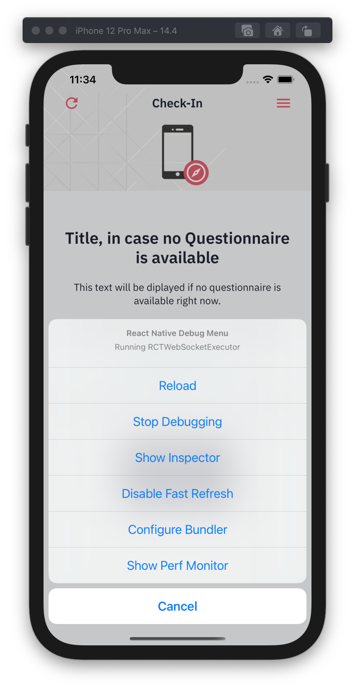

:tip-caption: :bulb:
:note-caption: :information_source:
:important-caption: :heavy_exclamation_mark:
:caution-caption: :fire:
:warning-caption: :warning:

= Development Guide

https://github.com/NUMde/compass-numapp[Main Repository] | link:../[List of Content]

This section of the documentation will give a brief overview of some aspects that might be of help should you choose to actively take part in the development community.

== Project Structure
When you checkout the project for the first time it will look somewhat like the following tree. There will be some other additional files but these are the most important ones:

```
compass
├── __tests__
├── __mocks__
├── __utils__
├── android
├── docs
├── ios
├── node_modules
├── patches
├── src 
│   ├── assets
│   ├── components
│   ├── config
│   ├── CUSTOMIZATION
│   ├── navigation
│   ├── screens
│   ├── services
│   ├── theme
│   ├── typedef.js
|   └── store.js
└── App.js
```
* *_ /__tests__ _* + 
The directory containing link:https://jestjs.io/[Jest] Frontend Tests. Those tests utilize link:https://testing-library.com/docs/react-native-testing-library/intro/[React Native Testing Library] for their implementation.

* *_ /__mocks__ _* + 
The directory containing the mock services for the link:https://jestjs.io/[Jest] Frontend Tests.

* *_ /__utils__ _* + 
The directory containing the utilities needed (renderer and mock-redux-store) for the link:https://jestjs.io/[Jest] Frontend Tests.

* */android* + 
The working directory for the android project.

* */docs* + 
The documentation files.

* */ios* + 
The working directory for the ios project.

* */node_modules* + 
The home of all the files that npm will install.

* */patches* + 
Holds some additional patches that will be installed after a successful *npm install*.

* */src* + 
Contains the source files.

** */assets* + 
This is where the additional files (images, fonts, etc...) are located.

** */components* + 
This contains all react components that are not screens. Each component has a directory containing the `.js` file, along with other necessary files (like local styles, etc...)

** */config* + 
Holds various configurations files. For more information see: + 
*`link:..//appConfiguration[-> App Configuration]`* + 
*`link:..//content[-> Content Configuration]`* + 

** */CUSTOMIZATION* + 
This contains the customization files that can be used to alter the style, content and some app options. 
For more information see: + 
*`link:..//appConfiguration[-> App Configuration]`* + 
*`link:..//content[-> Content Configuration]`* + 
*`link:..//theming[-> Theme Customization]`* + 

** */navigation* + 
Provides the App-Navigator, basically the definition of which screen is provided under specific circumstances.

** */screens* + 
+ 

This is where the screen components are located. A screen component is a React component which takes up the entire display and is therefore part of the navigational hierarchy. Each screen has a respective container file, which handles the business logic and provides the component with access to the current state as well as to additional methods defined within the container. + 
+ 
Each Screen also represents a state of the app. The app provides three states, as there are three main screens (Login, CheckIn & About) +  
+ 
Each screen component has a directory containing following files along with any assets or other helper files:  
+ 
--
```
ignite-project
├── src
│   ├── screens
│   │   ├── FEATURE
│   │   │   ├── FEATUREScreen.js
│   │   │   ├── FEATUREContainer.js
│   │   │   ├── FEATUREActions.js
│   │   │   └── FEATUREReducer.js
```
--


** */services* + 
The services directory provides simple JavaScript modules that (after import) provide specific functionalities:
*** */accessibility*: + 
Provides functionality around the newly added accessibility feature
*** */encryption* + 
Used to encrypt an outgoing questionnaire response
*** */localStorage* + 
The module handling the internal storing of session data
*** */questionnaireAnalyzer* + 
Used to handle the creation of a questionnaire response and to check the completion of a filled out questionnaire
*** */rest* + 
Handles all outgoing calls

** */theme* + 
Holds the theme for the application, including spacing, colors, and typography. To updated it follow the steps provided by the *`link:..//theming[Theming Documentation]`*.

** *store.js*
Defines the appReducer by combining all state reducers.

** *typdef.js* + 
Holds some type definitions.

* *App.js* + 
The starting point of the REACT-Native Application.

== Accessibility

Both Android and iOS provide some Accessibility features (like TalkBack and VoiceOver) that are supported in order to have an inclusive application for visually impaired users. 

* *accessible* (iOS & Android) + 
Is used to describe that the view is an accessibility element. When a view is an accessibility element, it groups its children into a single selectable component. By default, all touchable elements are accessible.

* *accessibilityLabel* (iOS & Android) + 
Is used to describe the label, so that people who use VoiceOver know what element they have selected. VoiceOver will read this string when a user selects the associated element. If no accessibilityLable is set, the label will be created by default, by concatenating all Text node children separated by spaces.

* *accessibilityHint* (iOS & Android) + 
Is used to describe what will happen when they perform an action on the accessibility element, when that result is not apparent from the accessibility label. (i.e. a "go back" label and a "navigates to the previous screen" hint)

* *accessibilityRole* (iOS & Android) + 
Us used to describe the purpose of a component. In this application, following can be useful:

** *button* + 
Used when an element should be treated as a button.
** *link* + 
Used when an element should be treated as a link.
** *image* + 
Used when an element should be treated as an image. Can be combined with button or link, for example.
** *text* + 
Used when an element should be treated as static text that cannot change.
** *header* + 
Used when an element acts as a header for a content section (e.g. the title of a navigation bar).
** *alert* + 
Used when an element contains important text to be presented to the user.
** *checkbox* + 
Used when an element represents a checkbox which can be checked, unchecked, or have mixed checked state.
** *combobox* + 
Used when an element represents a combo box, which allows the user to select among several choices.
** *menu* + 
Used when the component is a menu of choices.
** *radio* + 
Used to represent a radio button.
** *radiogroup* + 
Used to represent a group of radio buttons.

* *accessibilityState* (iOS & Android) - is used to describe the current state of a component. In tis application, the accessibilityState.selected could be used to describe if an item is currently selected or not.

=== Examples:

*accessible, accessibilityLabel and accessibilityHint*
``` 
<TouchableOpacity
  accessible={true}
  accessibilityLabel="Go back"
  accessibilityHint="Navigates to the previous screen"
  onPress={this._onPress}>
  <View style={styles.button}>
    <Text style={styles.buttonText}>Back</Text>
  </View>
</TouchableOpacity>
```

*accessibilityRole*
``` 
<View
  style={styles.header}
  accessible={true}
  accessibilityLabel={"Main app header"}
  accessibilityRole={"header"}
>
```

*accessibilityState (according to https://github.com/facebook/react-native/commit/099be9b35634851b178e990c47358c2129c0dd7d)*
```
<View
  style={styles.radiobutton}
  accessibilityState={{'selected': true}}
>
```

== State Management / Redux

A state is anything that changes over time (i.e. in a Counter App, the state could be the counter itself). Therefore, state management refers to how the properties/variables/changes are managed and handled. 

link:https://redux.js.org/[Redux] provides a predictable state container to centralize the global store of an application. It includes features like `store`, `reducer`, `actions` and `middleware`s, and methods such as `connect`, `mapStateToProps`, `mapDispatchToProps`and `bindActionsCreator`. Those allow to easily create and manage applications and their states.

=== Global Store and Root Reducer
The App component is wrapped in a `Provider` from `react-redux` (see *`link:../../../../tree/main/App.js[App.js]`*), which has a store as its props. This store is built by passing the **root reducer** to the `createStore()` method (see *`link:../../../../tree/main/src/store.js[App.js]`*).
This global store allows different components to share data.

The root reducer combines all reducers (see section **Reducers**) of an application together. The reducers are linked to the root reducer in the `store.js` file by calling `combineReducers()`.

```
const rootReducer = combineReducers({
  Login: LoginReducer,
  App: AppReducer
});

const middleware = [];
middleware.push(thunk);

export default createStore(rootReducer, applyMiddleware(...middleware));
```

=== Reducers

Reducers hold the state of the respective component(s). Each feature has its own reducer, which is responsible for the state within this feature/screen and can be found under `src/screens/FEATURE/reducer.js`. This file should always hold an `initialState`, as the default state, and `actionHandlers`, which - when called - can change the state accordingly.

=== Actions

Actions include tasks, which change the state. For example, when a user logs into the app, the triggered action would entail the authentication, and saving the user data, after this is done, then the action will dispatch information about a state-change. This information will be picked up by the `reducer`, which then changes the state. 

=== Container

Container should represent the link between UI and Logic/State. If a container wants to use and/or change data, it must first connect itself to the corresponding reducer and actions. Therefore, following lines must be called in every container (example given for Feature Login):

```
const mapStateToProps = state => {
    return state.Login;
};

const mapDispatchToProps = dispatch => {
    return { loginActions: bindActionCreators(loginActions, dispatch)}
};

const ConnectedLogin = connect(mapStateToProps, mapDispatchToProps)(LoginContainer);
```

== Push Notifications

Follow the instructions in the README of the link:https://github.com/ibm-bluemix-mobile-services/bms-push-react-native[React-Native plugin for IBM Cloud Push Notifications service] to get the Push Notifications Service up and running.

=== Remarks regarding iOS: 

You necessarily need a developer provisioning profile & corresponding signing certificate, to be able to run and test the app with notifications on your device. The Simulator isn't able to register & receive push notifications.

To test the notifications on your phone, you have to clone link:https://github.com/NUMde/compass-numapp-backend[COMPASS mobile back end] as well and start the server locally. After starting the server you have to forward the localhost listening port to be available for the iPhone, e.g. expose with ngrok
```bash
ngrok http 8080
```
Additionally, the value of *baseUriDevelopment* url (located in *`link:../../../../tree/main/src/config/appConfig.js[appConfig.js]`*) has to be set to this public url.

To trigger a notification just send a HTTP GET request to http://localhost:8080/api/test (e.g. via browser)

== Good Practices

=== Using the Debug Menu
[cols=>1d;2d,width=100%, frame="none", grid="none"]
|===
|
|When running the development build in a simulator, a debug menu is available. It can be opened by hitting *d* in launchPackager.command window. It allows for using a browser developer window to debug the application as well as some other useful features. 

For more information on this visit link:https://reactnative.dev/docs/debugging[the React Native Documentation on Debugging]
|=== 

=== Reading the current Redux State
*When in debug mode*, the app will output any action in the developer console as well as all states before that action and after it. You can access the content of all states at any time:

image:./images/states.png[auto, 600]
