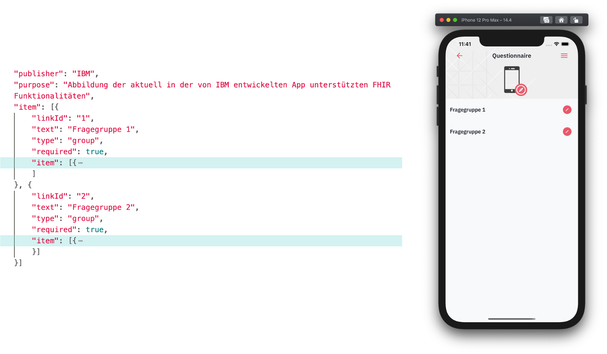
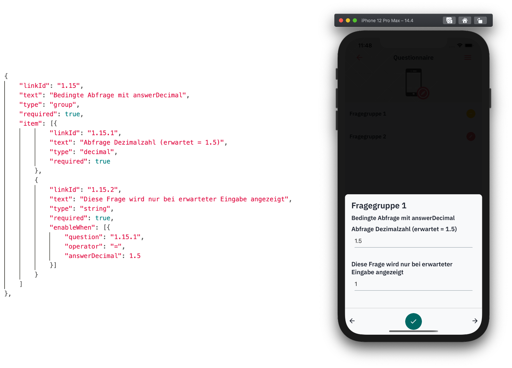
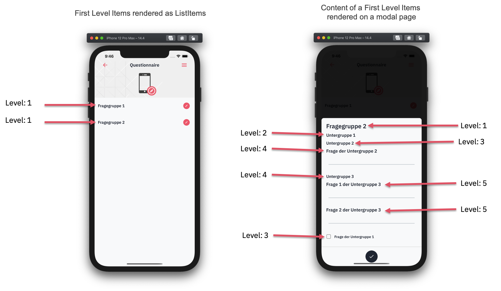
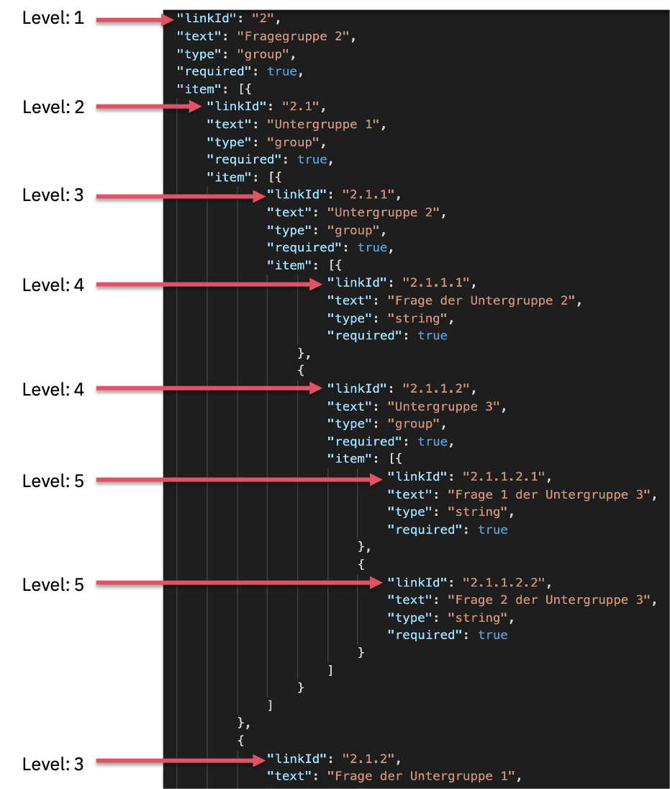

= Questionnaire Requirements

https://github.com/NUMde/compass-numapp[Main Repository] | link:../[List of Content]

The NUM-Compass project uses FHIR to encode questionnaires. 
However, only the necessary subset of extensions and attributes is supported as of now. Furthermore, there are certain requirements concerning the structure of the questionnaires that need to be met in order for the NUM-APP Frontend to work properly.

Please use this information in combination with the https://www.hl7.org/fhir/[official FHIR documentation]

== LinkIds
=== Form
The LinkId of each FHIR item needs to adhere to the following form:

`*Level_1*[*.Level_2*[ … *.Level_n*]]`

Each level needs to be represented by a natural numerical value. Examples could look like this:
....
1
1.1
1.1.1
12.2.1
23.6.16.7
....

=== Meaning
The idea is, that the NUM-App Frontend can use the numeric values and the number of dots in the id to determine where an item will be rendered. For example: A LinkId without any dots in it is a first level item. A link with one dot in it is a second level item, and so on:

`*[Level of an item]* = *[Number of dots in the LinkId]* + *1*`

IMPORTANT: The values of the items need to be set in order. This is important,as sibling-items are being represented in an array (using the FHIR standard).

==== First Level Items
* Any first level item is used as a category and is also represented by a listitem on the CheckIn Screen:
+ 
--

--
* A first level item is therefore supposed to be of type *group*, as it contains all items of particular topic.

* The Link ID of any first level item is constructed of just (positive) numerical values (no dots).

* If the user clicks on one of these listitems, a modal will show up that holds all sub-items (meaning all items that start with same *Level_1 value*, but contain at least one dot) of the category. These are paginated based on their *Level_2 value*.

==== Second Level Items
* Any item that contains exactly one dot in its LinkId is a second level item.
* All second level (and nth-level) items that share the first two numerical values in there LinkId, will be rendered on a single modal page. For example, all of these items would be rendered on the same modal page, as they share the same first two numerical values: + 
+ 
--
....
1.2.1
1.2.2
1.2.2.1
1.2.2.1.1
1.2.3
....
--
+ 
On the other hand, these LinkIds would always be rendered on separate modal pages, even if they belong to the same top-level item: + 
+ 
--
....
1.1
1.3.1
1.4
2.3.1
1.2.2.1.1
1.8.3
....
--
+ 
--
*Here is an example:* + 
 +
Both items a rendered on the same modal page, because their LinkIds contain the same first two levels.
--

==== Nth-Level Items
* Any item that contains at least two dots in its LinkId is a nth-level item.
* Each nth-level item will be rendered directly below its parent.
* The fontsize is determined by the number of dots within the LinkId.
* All nth-level items that share the first two numerical values in there LinkId, will be rendered on a single modal page.

=== Nesting Example
The following example is meant to demonstrate how the nesting of items is visualized within the application.

== EnableWhen Conditions

Right now, only the `=` operator is available for conditional rendering. More complex scenarios can be realized by using the `enableWhen` property with the value of `any` or `all`.

* Available Operators
** `=`

=== Available EnableBehavior Values
* `any`
* `all`

== Available Extensions
As of now, six extensions can be used, that are related to the use of a slider:

* http://hl7.org/fhir/R4/extension-questionnaire-itemcontrol.html
* http://hl7.org/fhir/StructureDefinition/questionnaire-lowRangeLabel
* http://hl7.org/fhir/StructureDefinition/questionnaire-highRangeLabel
* http://hl7.org/fhir/StructureDefinition/questionnaire-sliderStepValue
* http://hl7.org/fhir/StructureDefinition/minValue
* http://hl7.org/fhir/StructureDefinition/maxValue

== Available ItemType Values
As of now, the following item types are supported:

* `string`
* `choice`
* `boolean`
* `date`
* `open-choice`
* `integer`
* `decimal`

