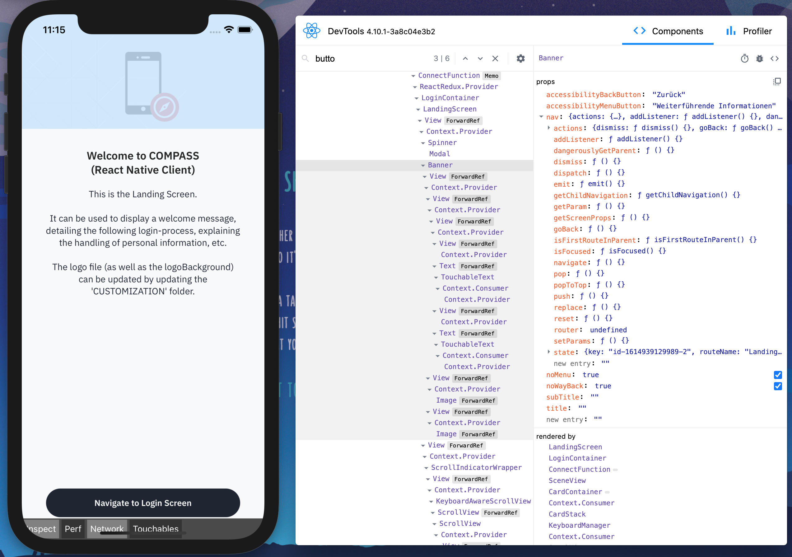
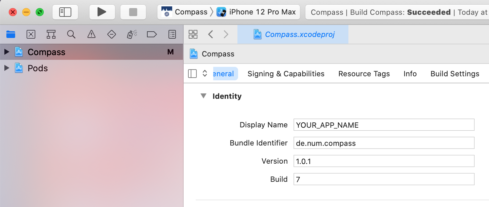
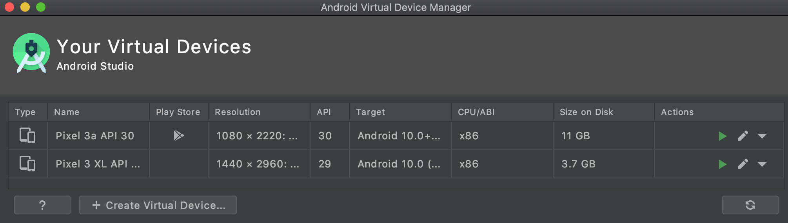
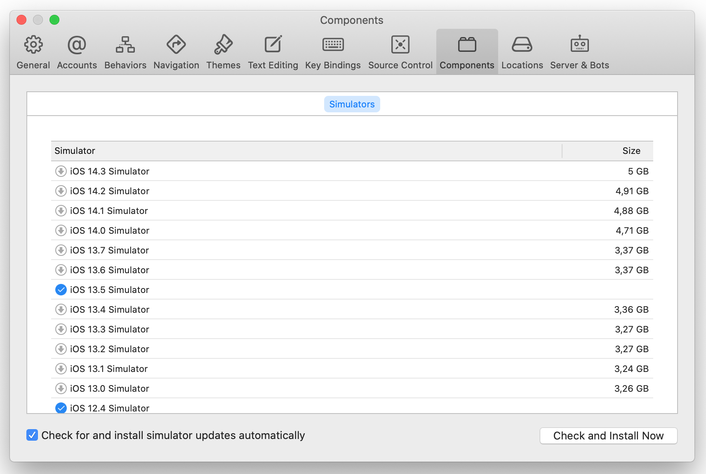
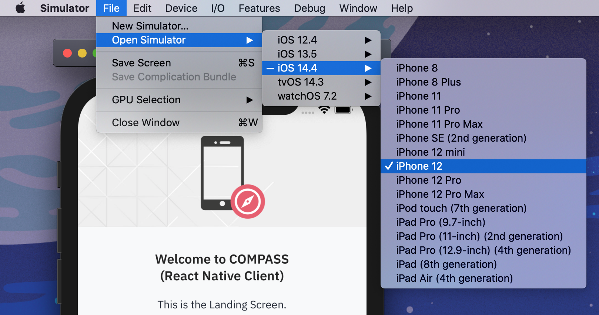

= Setup & Production Build

https://github.com/NUMde/compass-numapp[Main Repository] | link:../[List of Content]

== Initial Setup

To setup your local environment and the prerequisites for the build, a few manual steps are necessary. Follow these instructions to setup your development environment.

IMPORTANT: An iOS build can only be generated by using XCode, which requires a Mac to work with. Android development is possible in Windows environment

. *Setup your Development Environment (React Native CLI Quickstart)* +
React Native needs a few tools installed beforehand, depending on your own environment and target-OS. Please follow the instructions provided by the official React Native documentation: +
link:https://reactnative.dev/docs/environment-setup[https://reactnative.dev/docs/environment-setup] +
+
IMPORTANT: Please follow these instructions exactly! If you intend to use an Android emulator and/or iOS simulator, make sure these are installed and configured. Android Studio and XCode do not necessarily come with the ones you prefer already installed or pre-configured.

. *Installing Dependencies*
+
--
On MacOS, run the following command to install all necessary packages. This includes all iOS Pods as well as Watchman tasks.
....
npm run clean_install_macos
....

If you are working on windows, please use this command (it omits the MacOS installation part): 
....
npm run clean_install_windows
....
TIP: This command can also be useful when trying to dissolve build problems after dependency updates.
--

. *Create local.properties*
+
--
Android Studio needs a file `local.properties` referencing the android-sdk location. Create the file inside the *`link:../../../../tree/main/android[android]`* directory with the content as follows: + 

*`sdk.dir = [LOCATION_OF_YOUR_ANDROID_SDK]`*

For MacOS users, the sdk is located (most of the time) at:

....
sdk.dir = /Users/[YOUR_USERNAME]/Library/Android/sdk
....

The path for windows user looks somewhat like this (depending on where it was installed):

....
sdk.dir = c:\Users\[YOUR_USERNAME]\AppData\Local\Android\Sdk 
....
--

. *Create Upload Keystore File*
+
--
Android requires that all apps be digitally signed with a certificate before they can be installed. In order to distribute a Compass App via Google Play store, it needs to be signed with a release key that then needs to be used for *all future updates*. Thanks to App Signing by Google Play functionality it is possible to manage signing releases automatically. However, before the application binary can be created (meaning *.apk / .aab* files) and uploaded to Google Play it needs to be signed with an *Upload Key*. This key is also needed to actually compile and create the needed *.apk / .aab* files.

For more information on publishing to Google Play visit: + 
https://reactnative.dev/docs/signed-apk-android

To create the keystore follow these instructions:

*Navigate to your android/app directory*

....
cd android/app
....

*Create the keystore*
....
keytool -genkey -v -keystore key.store -alias COMPASS -keyalg RSA -keysize 2048 -validity 10000
....

The process creating the keystore will first ask for a *keystore-password* and an *upload-key-password*. The password (you can use identical passwords) you choose has to be added to the file *`link:../../../../tree/main/android/gradle.properties[android/gradle.properties]`*. Open it and alter its content to match your choice:

....
MYAPP_UPLOAD_STORE_PASSWORD=[YOUR_CHOSEN_PASSWORD]
MYAPP_UPLOAD_KEY_PASSWORD=[YOUR_CHOSEN_PASSWORD]
....

--

. *Create Debug Keystore File*
+
--
To run a build on an Android Device or Simulator during development, another keystore file is needed to sign the build. This time no alias or password is needed:

*Navigate to your android/app directory*

....
cd android/app
....

*Create the keystore*
....
keytool -genkey -v -keystore debug.keystore -storepass android -alias androiddebugkey -keypass android -keyalg RSA -keysize 2048 -validity 10000
....
--

. *OPTIONAL: Install React Native DevTools*
+
--
This package enables you to debug a React-Native app elsewhere (e.g. a mobile browser, an embedded webview, Safari, inside an iframe).
....
npm install -g react-devtools
....
TIP: There are two aspects to this: React-Dev-Tools allows for debugging React components and also makes it possible to debug styles in React Native. This feature also works with the inspector in the developer menu. You can debug and implement style properties and see the effect of the change instantly without reloading the app.
 +
  + 

The devtools can be of enormous help, but it is not required. For more information visit link:https://github.com/facebook/react/tree/master/packages/react-devtools[https://github.com/facebook/react/tree/master/packages/react-devtools]
-- 
. *OPTIONAL: Clean Re-Install*
+
--
Run the `clean_install_macos` (or `clean_install_windows) command again. Android Studio and XCode might act a bit cranky after the manual update of a few files. Running the `clean_install_*` command again dissolves those issues.
....
npm run clean_install_macos
npm run clean_install_windows
....
--
. *OPTIONAL: Reboot*
+ 
This can be necessary on MacOS and Windows devices - especially after updates concerning XCode and/or Android Studio.

== App Name and Bundle Identifier/Package Name

Android and iOS need an app name to render below the app icon. Another important aspect is the bundle identifier (for iOS) or, respectively the package name (in the case of Android) - and both need to be unique. This means that there cannot be two apps on the stores with the same bundle identifier (Apple App Store) or package name (Google Play).

IMPORTANT: Once you have published your app to either the App Store or Google Play, you cannot change the bundle identifier/package name again. You need to be sure before you publish your project.

To update name and identifier proceed as follows:

=== Android
The default *Package Name* for the Android Build is:
....
de.num.compass.android
....

The default *App Name* for the Android Build is:
....
Compass (Android)
....

To change those values follow these instructions:

.. Open the file *`link:../../../../tree/main/android/app/src/main/res/values/strings.xml[android/app/src/main/res/values/strings.xml]`*.
.. Update the content of the string tag with you preferred *Android App Name*: + 
+ 
--
....
<resources>
  <string name="app_name">YOUR_APP_NAME</string>
</resources>
....
--
.. Find and replace any occurrence of the string `de.num.compass.android` with your new preferred package name. Include every file of the Compass project in this query - the string will occur a few times.

=== iOS
The default *Bundle Identifier* for the iOS Build is:
....
de.num.compass.ios
....
The default *App Name* for the iOS Build is:
....
Compass (iOS)
....

You can update the iOS App Name and Bundle Identifier by simply open the *`link:../../../../tree/main/ios/Compass.xcworkspace[.xcworkspace]`* file in XCode. The _General_ tab will provide inputs for both values: +

.Updating the Display Name / Bundle Identifier in Xcode
[caption="Example: "]
==========================

==========================

==== Without using XCode
Should you want to update these values without using XCode, proceed as follows:

.. Open the file *`link:../../../../tree/main/ios/Compass/Info.plist[ios/Compass/Info.plist]`*.
.. Update the content of the string under the *CFBundleDisplayName*-tag with you preferred *iOS App Name*: + 
+ 
--
....
<key>CFBundleDisplayName</key>
<string>YOUR_APP_NAME</string>
....
--
.. Open the file *`link:../../../../tree/main/ios/Compass.xcodeproj/project.pbxproj[ios/Compass.xcodeproj/project.pbxproj]`*.
.. Search for the key *PRODUCT_BUNDLE_IDENTIFIER* (all occurrences) and set its value to your preferred *iOS Bundle Identifier* + 
+ 
--
....
PRODUCT_BUNDLE_IDENTIFIER = YOUR_IOS_BUNDLE_IDENTIFIER;
....
--

== Development-Build 

While developing, a live preview is irreplaceable. So with any persisted change in your code you can create and run a new development build on iOS-Simulators & Android Emulators, as well as physical devices. For that to work you need to start a development server which will funnel your build into your chosen emulator/simulator/device.

* *To start the development server for the android environment, run*
+
--
....
npm run android
....
Android Studio must be installed and configured in order for this to work. Should you want to execute/debug the application on a physical device, make sure it is connected via cable and that link:https://developer.android.com/studio/command-line/adb[ADB] can find it:
....
adb devices
....
The output should look something like that:
....
List of devices attached
74957e16	device
....

The app should be installed and opened on the device.

TIP: Emulators can be added by using the Android Virtual Device Manager provided by Android Studio (*Android Studio -> Tools -> AVD*) +
 +

--

* *To start the development server for the iOS environment, run*
+
--
....
npm run ios
....

It is also possible to directly choose which Simulator should be opened by using another command instead:
....
npx react-native run-ios --simulator="iPhone 12"
....

Should you need a list of the available Simulator names, try:
....
xcrun simctl list
....

TIP: You can add new iOS Simulators through the *Components tab* of the *XCode Settings*: +
 +

TIP: You can also start any other available Simulator through the *Simulator-File-Menu*: +
 +

TIP: For more information on how to execute your build on a physical iPhone, please visit: 
https://developer.apple.com/documentation/xcode/running_your_app_in_the_simulator_or_on_a_device

--

* *To start the React-Dev-Tools, run*
+
--
....
react-devtools
....
--
