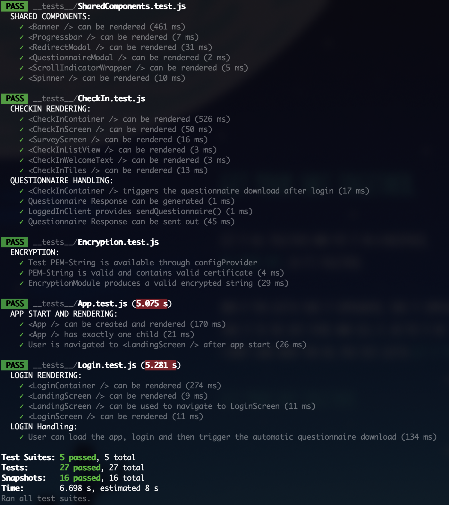

== Testing

https://github.com/NUMde/compass-numapp[Main Repository] | link:../[List of Content]

Testing is conducted using https://jestjs.io/[Jest] and https://testing-library.com/[React Native Testing Library].

=== Executing the Tests

*To run the tests, run:*
....
npm run test
....

The resulting output should look somewhat like this one:
==========================

==========================

=== Updating and editing new Tests

There are three directories necessary for the testing the application. Add your tests and mock services accordingly:

```
compass
├── __tests__
├── __mocks__
└── __utils__

```
* *_ /__tests__ _* + 
The directory containing link:https://jestjs.io/[Jest] Frontend Tests. Those tests utilize link:https://testing-library.com/docs/react-native-testing-library/intro/[React Native Testing Library] for their implementation.
New test can be added here.

* *_ /__mocks__ _* + 
The directory containing the mock services for the link:https://jestjs.io/[Jest] Frontend Tests.

* *_ /__utils__ _* + 
The directory containing the utilities needed (renderer and mock-redux-store) for the link:https://jestjs.io/[Jest] Frontend Tests.