:tip-caption: :bulb:
:note-caption: :information_source:
:important-caption: :heavy_exclamation_mark:
:caution-caption: :fire:
:warning-caption: :warning:

= Styling the React Native Client

https://github.com/NUMde/compass-numapp[Main Repository] | link:../[List of Content]

== Setting up a Custom Theme

The visual style, as well as other aspects of the react-native client can be adjusted to your needs. The project comes with a set of configuration files that allow for quick and indiviual changes. The file responsible for the currently used theme is **`link:../../../../tree/main/src/theme/theme.js[src/theme/theme.js]`**.

WARNING: However, it is not recommended to alter this file directly, as it will aggravate the process of merging future updates into your own forked project. To ensure the updatability of your repository, another file is provided: **`link:../../../../tree/main/src/CUSTOMIZATION/customTheme.js[src/CUSTOMIZATION/customTheme.js]`**
**`link:../../../../tree/main/src/CUSTOMIZATION/customTheme.js[customTheme.js]`**. You can copy the content of the file **`link:../../../../tree/main/src/theme/theme.js[theme.js]`** into **`link:../../../../tree/main/src/CUSTOMIZATION/customTheme.js[customTheme.js]`**. There you can change the configuration values as you see fit. Both files contain explanations on how and where to copy the values.

.Copying the config to generate a custom theme
[caption="Example: "]
==========================
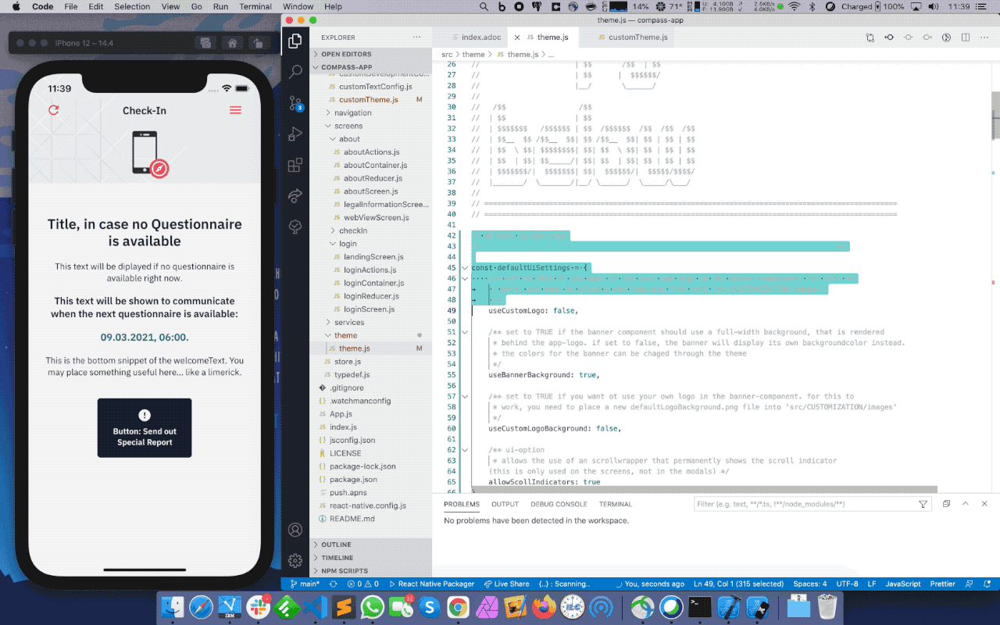
==========================

IMPORTANT: Please make sure to copy the whole content below the marked point, and not just parts of it.

== Accessing the Theme
Should you want to add your own components, you can use the values provided by the theme.

When compoments import the theme, the regular configuration values from **`link:../../../../tree/main/src/theme/theme.js[theme.js]`** and the custom ones (**`link:../../../../tree/main/src/CUSTOMIZATION/customTheme.js[customTheme.js]`**) will be merged, with the custom ones overwriting the default values.

To access the theme you just need to import the file **`link:../../../../tree/main/src/config/configProvider.js[src/config/configProvider.js]`**. This is already done by default for existing components, but you have to do it manually for new ones should you want to add some. The imported object provides a property called 'theme', which in turn provides the different theme-properties:

[source, JavaScript]
----
import config from '../../config/configProvider'

// config.theme.colors  -> holds the color values of the application
// config.theme.fonts   -> holds the font values of the application
// config.theme.classes -> holds some predefined StyleSheet-Objects 
// config.theme.values  -> holds default-style-values values of the application
// config.theme.ui      -> holds some minor option abput the ui
----

IMPORTANT: Please use the provided file **`link:../../../../tree/main/src/CUSTOMIZATION/customTheme.js[customTheme.js]`** to update the default-style (like described above)

== Colors
The color values provided by the theme variable (_config.theme.colors_) are as follows:

* *primary*
The primary color of the scheme. Most buttons are of this color by default, as is the top banner

* *secondary*
Highlighting for a not fully completed questionnaire (yellow-ish by default)

* *success*
Highlighting for completed questionnaires, as well as some icons (green-ish by default)

* *alert*
Mostly used for "abort"-buttons and error messages (red-ish by default)

* *accent1*
The color primarily used for disabled elements

* *accent2*
A more subtle grey which is used for borders, backgrounds and icons

* *accent3*
An even more subtle grey - also used for borders and backgrounds

* *accent4*
A relatively dark grey, used for most texts instead of black (more eye-friendly)

* *white*
Just plain white

* *loadingBackground*
The background color for the loading-spinner-animation

== Fonts
=== Setting up additional Fonts
The default font-files can be found under **`link:../../../../tree/main/src/assets/fonts[src/assets/fonts]`**. Additional ones should be added to **`link:../../../../tree/main/src/CUSTOMIZATION/fonts[src/CUSTOMIZATION/fonts]`**.
After you added the new fonts, run:

....
npx react-native link
....

This will link the new resources to your Android- & iOS-project. 

IMPORTANT: Please regard, that iOS will expect the *'PostScript name'* of the font, not the filename. Android on the other hand uses the filename. Please rename your fonts into their regarded PostScript name (can be looked up using font book):

.Using Font Book to extract the _PostScript name_ on MacOS
[caption="Example: "]
==========================
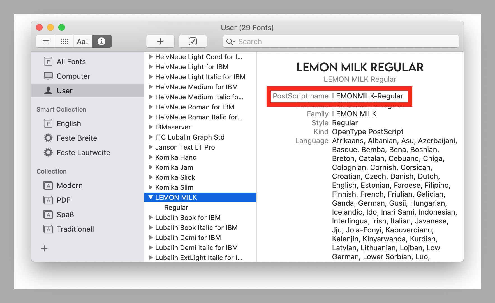
==========================

TIP: Should you want to remove a custom font after you already linked it, it's not enough to just remove the files and the mentions in your customTheme.js. You need to unlink it. You can do that by using XCode to remove the additional fonts from your Info.plist. After that you need to remove the entries also from the Build Phases Tab of your XCode Environment. Alternatively, you can search the project directory directly for the mention of the filename of the fonts that you want removed. There should be results in two files: *'Info.plist'* and *'project.pbxproj'*. Remove any line that mentions the fonts, and you are good to go.

=== Updating the Font Values

The numeric parameters of the font-objects (like *'fontSize'*, *'lineHeight'*) are altered by the *'scaleFontsFkt'* function located in **`link:../../../../tree/main/src/config/appConfig.js[src/config/appConfig.js]`**. The reason for this is to have an additional method to dynamically alter font- & layout-sizes. The function itself can be altered using **`link:../../../../tree/main/src/CUSTOMIZATION/customAppConfig.js[src/CUSTOMIZATION/customAppConfig.js]`**.

The following fonts are used in the application as of now:

* *IBMPlexSans-SemiBold*
* *IBMPlexSans*
* *IBMPlexSans-Italic*

== UI Settings / Banner-Logo

Some aspects of the UI can be updated through the theme. It is possible to use a different logo and background for the banner and to allow the use of scroll-inidcators. Should you want to use a custom logo, then you must replace the appropriate file under **`link:../../../../tree/main/src/CUSTOMIZATION/images[src/CUSTOMIZATION/images]`**. The images that can be found here are the ones that replaces the default ones should you configure it (using the properties pictured in the image below).

.Updating the default-ui-settings in **`link:../../../../tree/main/src/CUSTOMIZATION/customTheme.js[customTheme.js]`**
[caption="Example: "]
==========================
image:./images/uiConf.gif[auto, auto]
==========================

WARNING: These files must always exist, as they are accessed during the build of the application. That is the reason why by default already two files exist in **`link:../../../../tree/main/src/CUSTOMIZATION/images[src/CUSTOMIZATION/images]`** - as placeholders.

TIP: The images used for the banner will adjust automatically to fit the banner. But it is recommended to use a logoBackground with a minWidth of 800px and a minHeight of 300px. The logo itself should measure at least 300px x 300px. It depends on the Viewsize of your targeted devices. We encourage you to experiment with it :D

TIP: When you replace the placeholders with your custom logo and logo-background into **`link:../../../../tree/main/src/CUSTOMIZATION/images[the custim-images-directory]`**, make sure that the correct filenames are used: *'logo.png'* and *'logoBackground.png'*

== Styles

Style properties that are used throughout the application can also be found in **`link:../../../../tree/main/src/theme/theme.js[theme.js]`** (and updated through **`link:../../../../tree/main/src/CUSTOMIZATION/customTheme.js[customTheme.js]`**). Here, the default look for buttons, labels, etc. is defined. The inidiviual components will use these values to determine their own style. Said values will reference the already defined colors (see the image below) to enforce a coherent theme, but you can change that to whatever floats your boat. Alongside single values like *'defaultBackgroundColor'*, combined values in form of objects are also defined here (to provide multiple style-attributes at once for selected elements like buttons).

== Examples
=== The Good, The Bad & The Ugly

Last but not least, a few examples of what the app can look like:

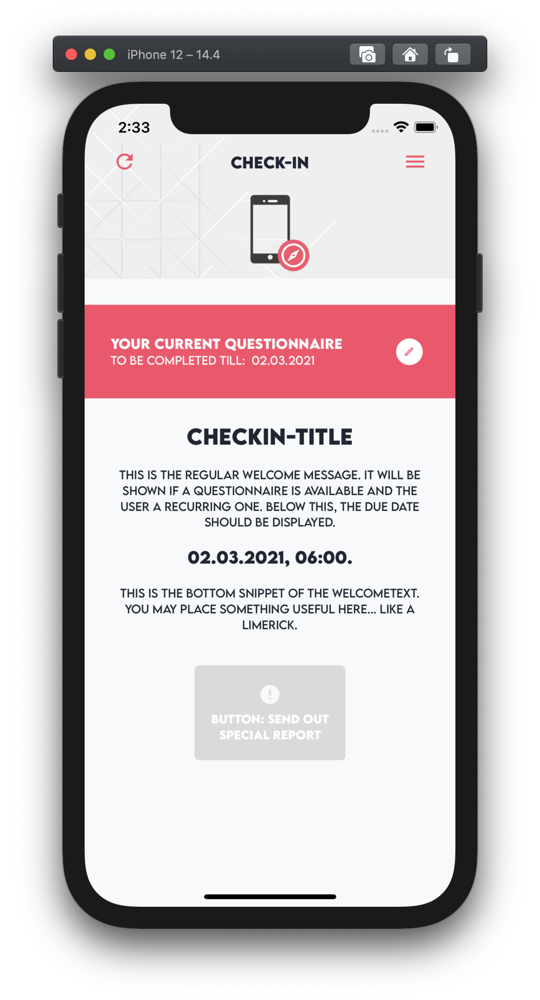
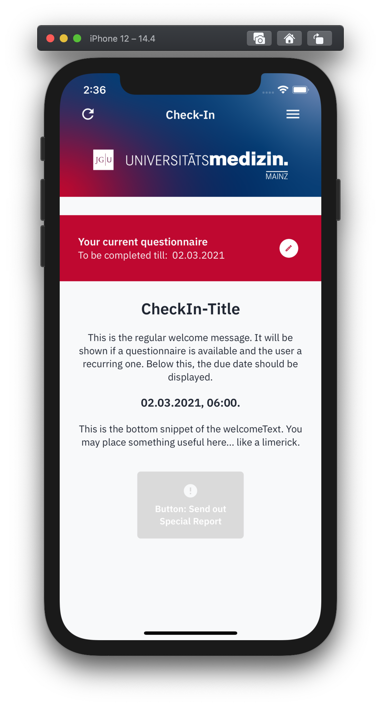
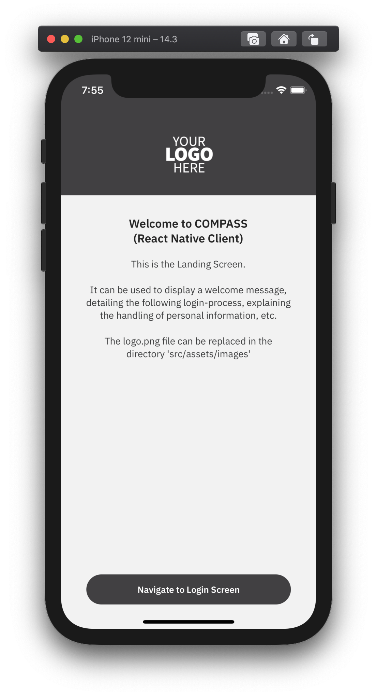
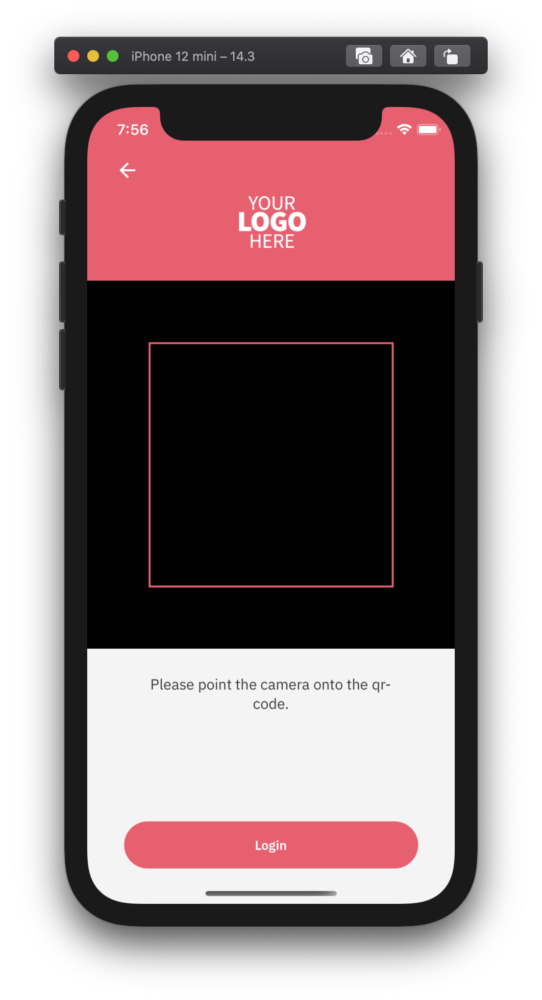
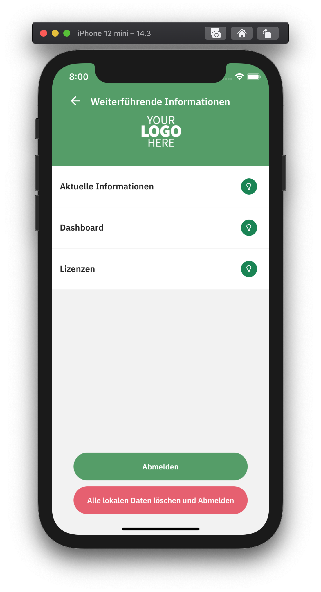
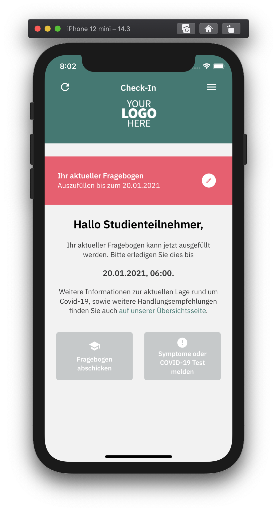
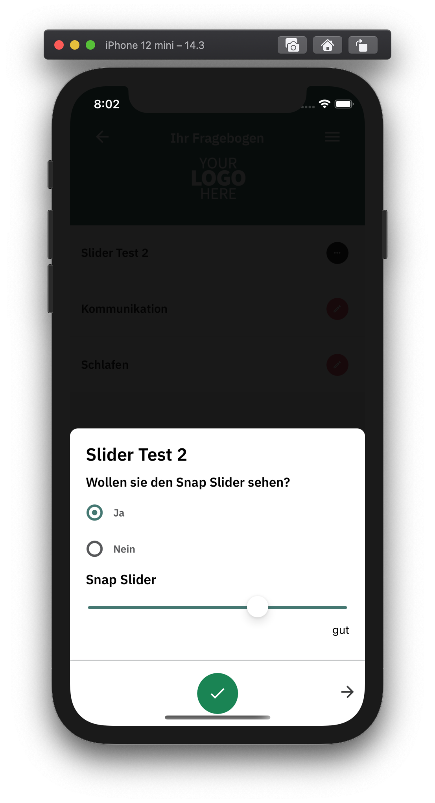
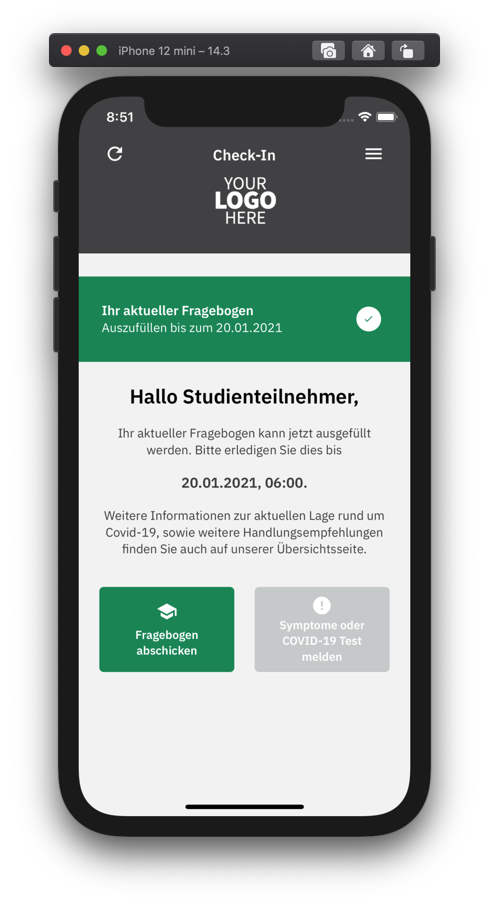
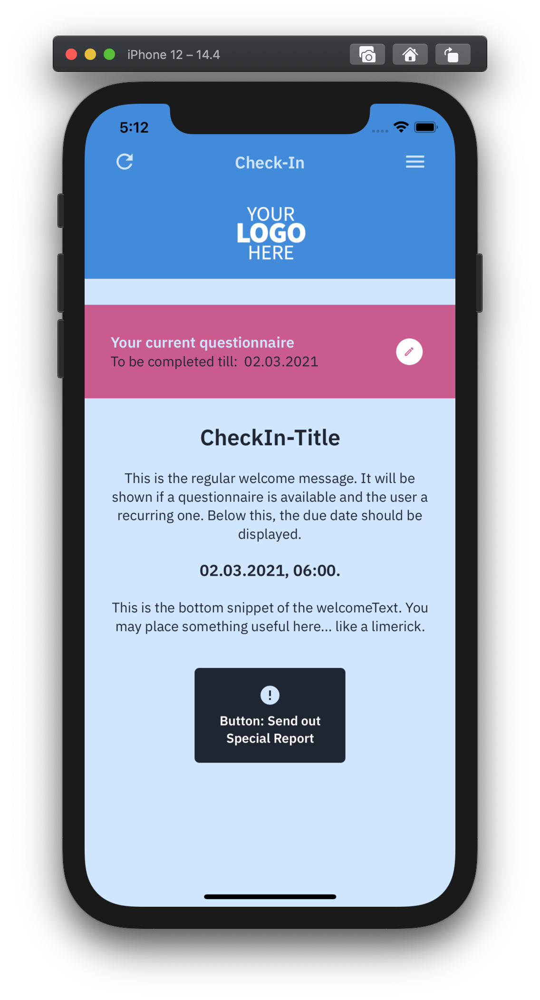
